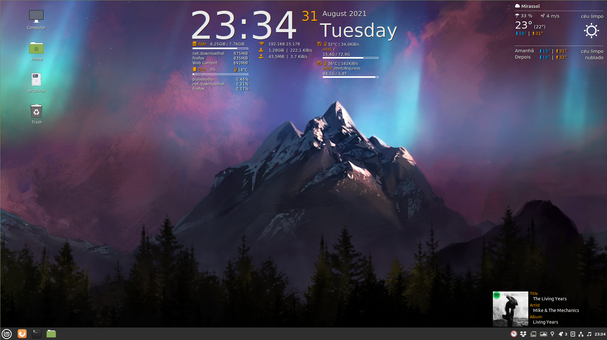

# seven-conky
### Conky with clock, disk, network, process, weather, music

* Conky Disks: show all disks dinamically, even mounted flash drives

* Conky Network: get network interface dinamically (try to guess to main one)

* Conky Music: integrates with Spotify and Clementine

* Conky Weather: uses OpenWeatherMap

#### Screenshot
	./start-conky.sh

## Weather conky
Weather conky, must be configured manually to set an api token and city id.

Create a config file from a sample one, copy: "Weather/conky-weather/WeatherConfig.sample.sh" to "Weather/conky-weather/WeatherConfig.sh"

Using bash on seven-conky root folder:

	cp Weather/conky-weather/WeatherConfig.sample.sh Weather/conky-weather/WeatherConfig.sh

Register an account and create an api key on [Open Weather Map API](https://home.openweathermap.org/api_keys)

To get the city id to get the weather, search your city id at: [Open Weather Map](https://openweathermap.org/), then copy the link of the city, something like: https://openweathermap.org/city/3457095 and use only the end number: 3457095

Set these configurations in the file Weather/conky-weather/WeatherConfig.sh

## Installing conky on Ubuntu/Mint
	sudo apt install conky conky-all

## Install dependencys on Ubuntu/Mint
#### FontAwesome:
	sudo apt install fonts-font-awesome

## To get temperature, need to allow regular user to execute hddtemp
	sudo chmod +s /usr/sbin/hddtemp

## Easy install this script
	bash <(curl -s https://raw.githubusercontent.com/evandro777/seven-conky/main/install.sh)

## Problems known
Listing network interfaces is using ifconfig -s (similar to netstat -i, which is deprecated), and there's a bug which cuts long interface's name.
Then some intefaces may not show.

[Discussion](https://bugzilla.redhat.com/show_bug.cgi?id=1557470)

## Some code and layouts which are inspired
[Gothan Conky](https://www.gnome-look.org/p/1084945)

[Conky-Spotify](https://github.com/Madh93/conky-spotify)

[Jelly-conky](https://github.com/muhammad-yasmin/jelly-conky)
